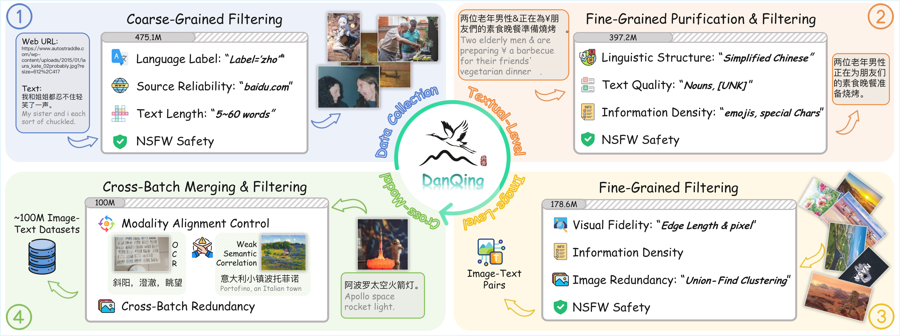
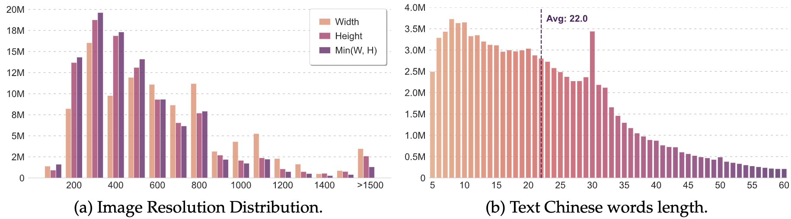
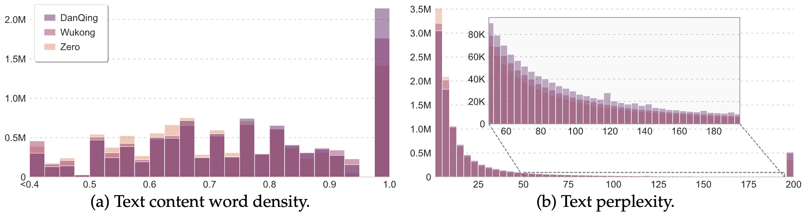
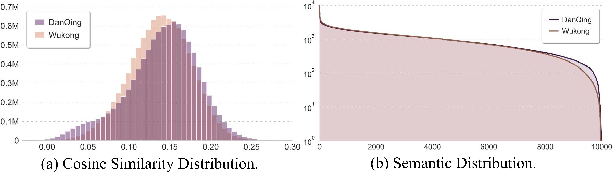
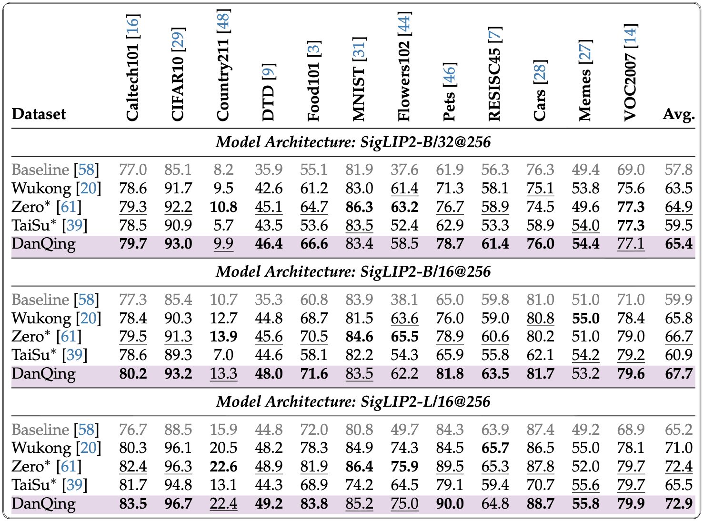
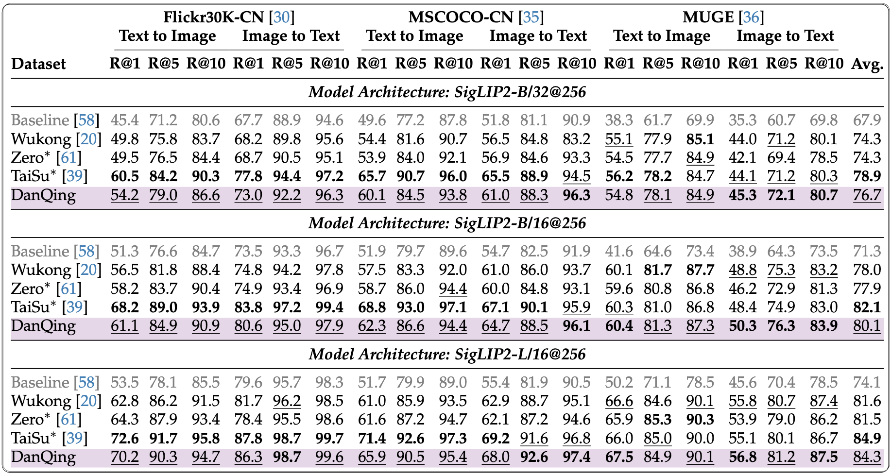
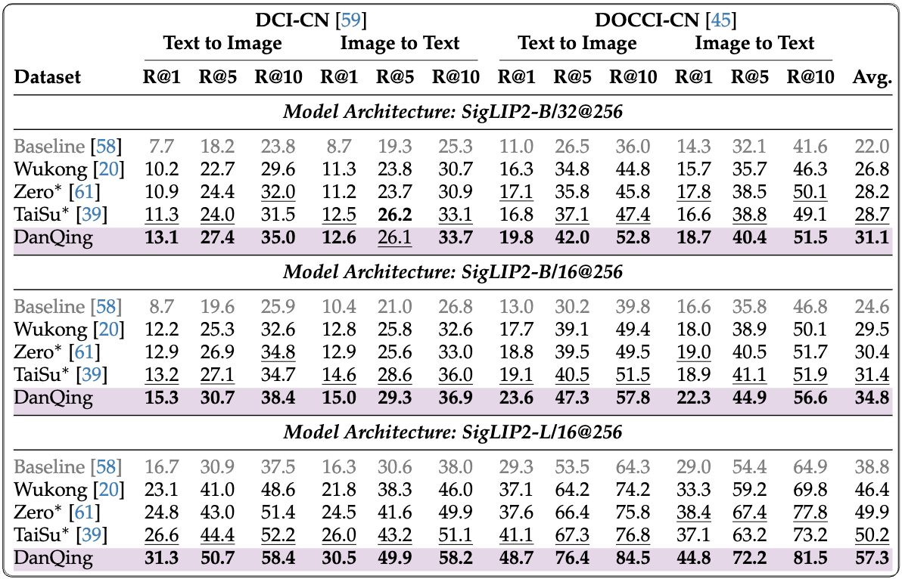
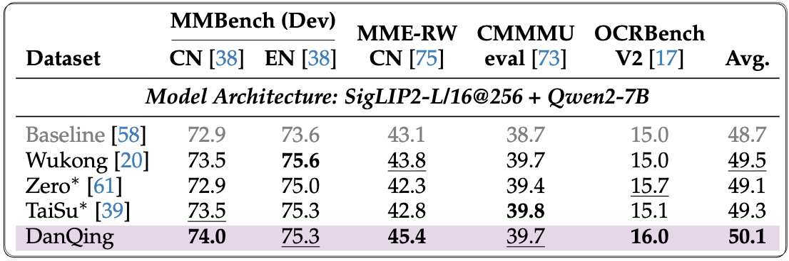
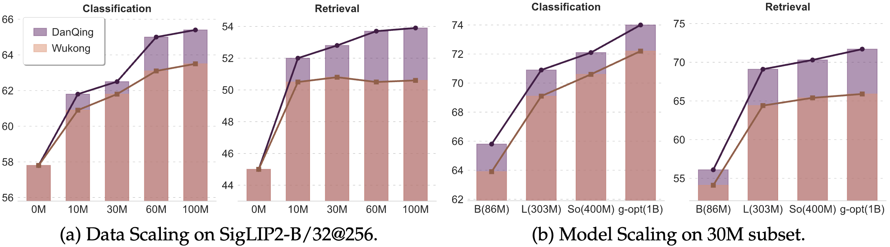
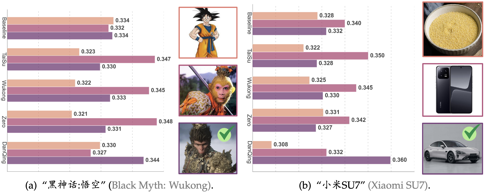

<div align="center">


**100M** Chinese image-text pairs | **12TB** dataset | **2024-2025** web data

<h1 align="center">DanQing: An Up-to-Date Large-Scale Chinese Vision-Language Pre-training Dataset</h1>

</div>


<div align="center">

Hengyu Shen<sup>∗</sup>, [**Tiancheng Gu**](https://scholar.google.com/citations?hl=zh-CN&user=9etrpbYAAAAJ)<sup>∗</sup>, Bin Qin, Lan Wu, Yuling Wu, Shuo Tan, [**Zelong Sun**](https://scholar.google.com/citations?user=mDxuGMgAAAAJ&hl=zh-CN), Jun Wang, Nan Wu, [**Xiang An**](https://anxiangsir.github.io/), [**Weidong Cai**](https://weidong-tom-cai.github.io/), [**Ziyong Feng**](https://scholar.google.com/citations?user=xlKttUEAAAAJ&hl=zh-CN)<sup>‡</sup>, [**Kaicheng Yang**](https://kaicheng-yang0828.github.io)<sup>†</sup>

<sup>∗</sup> Equal Contribution | <sup>‡</sup> Team Leader | <sup>†</sup> Project Leader

[]()
[](https://huggingface.co/datasets/DeepGlint-AI/DanQing100M)
[](https://www.modelscope.cn/datasets/deepglint/DanQing)
[](https://creativecommons.org/licenses/by/4.0/)


</div>

## 📣 News

<div align="left">

- [2026/01/16] ✨ We release the [paper]() of DanQing.
- [2026/01/15] 🔥 We release the DanQing dataset (images and captions, about 12TB) in [ ModelScope](https://www.modelscope.cn/datasets/deepglint/DanQing)
- [2026/01/13] ✨ We release the DanQing dataset (URLs of image and captions) in [🤗 Hugging Face](https://huggingface.co/datasets/DeepGlint-AI/DanQing100M)

> ⚠️ **Note:** Due to the storage and transmission limitations of Hugging Face, we only release the URLs corresponding to the images on Hugging Face. To access the complete dataset, please download it from **ModelScope**. We also provide synthetic short captions (generated by GLM4.1-base-9B) for the Danqing100M dataset in the recaption column.

</div>

---

## 📑 Table of Contents
- [💡 Highlights](#-highlights)
- [💻 Dataset Information](#-dataset-information)
  - [Data Preview](#data-preview)
  - [Topic Assessment](#topic-assessment)
  - [Image Resolution and Text Length Distribution](#image-resolution-and-text-length-distribution)
  - [Text Quality](#text-quality)
  - [Cosine Similarity and Semantic Distribution](#cosine-similarity-and-semantic-distribution)
- [📊 Performance Comparison](#-performance-comparison)
  - [Zero-Shot Classification](#zero-shot-classification)
  - [Cross-Modal Retrieval (Short Caption)](#cross-modal-retrieval-short-caption)
  - [Cross-Modal Retrieval (Long Caption)](#cross-modal-retrieval-long-caption)
  - [Chinese-Centric Large Multimodal Model Tasks](#chinese-centric-large-multimodal-model-tasks)
- [🧠 Analysis](#-analysis)
  - [Data and Model Scaling](#data-and-model-scaling)
  - [New Concept Understanding](#new-concept-understanding)
- [📥 Download](#-download)
  - [🤗 Hugging Face](#-hugging-face)
    - [Python API](#python-api)
    - [Command Line](#command-line)
  - [ ModelScope](#-modelscope)
    - [Python API](#python-api-1)
    - [Command Line](#command-line-1)
- [📄 License](#-license)
- [📝 Citation](#-citation)

---

## 💡 Highlights

In this paper, we propose **DanQing** dataset, which contains **100 million** image-text pairs collected from Common Crawl. Different from existing datasets, DanQing is curated through a more rigorous selection process, yielding superior data quality. Moreover, DanQing is primarily built from **2024–2025** web data, enabling models to better capture evolving semantic trends and thus offering greater practical utility. 

We compare DanQing with existing datasets by conducting continual pre-training of the SigLIP2 model. Experimental results show that DanQing consistently achieves superior performance across a range of Chinese downstream tasks, including zero-shot classification, cross-modal retrieval, and LMM-based evaluations.

<div align="center">
    
</div>

---

## 💻 Dataset Information

### Data Preview

<div align="center">
    
</div>

### Topic Assessment

We implement a topic modeling pipeline based on [BERTopic](https://github.com/MaartenGr/BERTopic). We randomly sample 10M image-text pairs and extract text embeddings using [Chinese-CLIP-L/14](https://github.com/OFA-Sys/Chinese-CLIP). To address high-dimensional clustering, we apply UMAP for dimensionality reduction, followed by HDBSCAN to identify semantic clusters with a minimum cluster size of 1,000 for stability and noise reduction. Finally, we use class-based TF-IDF to extract representative keywords for each topic.

<div align="center">
    
</div>

### Image Resolution and Text Length Distribution

We analyze image resolutions by width, height, and minimum dimension, demonstrating a wide range of visual scales. We also report the distribution of text lengths across **2.2B** Chinese words.

<div align="center">
    
</div>

### Text Quality

We evaluate the text quality of DanQing using two metrics: **semantic word density** and **perplexity (PPL)**. We randomly sample 10M texts from DanQing, Wukong, and Zero for comparison. Semantic words (nouns, verbs, adjectives) are identified using the jieba toolkit, and their proportion in each sentence is calculated as semantic density. Sentence-level perplexity is computed with a pre-trained Chinese [BERT](https://huggingface.co/google-bert/bert-base-chinese) model.

<div align="center">
    
</div>

### Cosine Similarity and Semantic Distribution

We analyze 10M-sample subsets of DanQing and Wukong by presenting image-text similarity distributions, extracted with [FG-CLIP2-L/16@256](https://huggingface.co/qihoo360/fg-clip2-large). For semantic distribution comparison, 10M images from each dataset are clustered into 10K groups using [FAISS](https://github.com/facebookresearch/faiss), with clusters ranked by sample count.

<div align="center">
    
</div>

---

## 📊 Performance Comparison

### Zero-Shot Classification

<div align="center">
    
</div>

### Cross-Modal Retrieval (Short Caption)

<div align="center">
    
</div>

### Cross-Modal Retrieval (Long Caption)

<div align="center">
    
</div>

### Chinese-Centric Large Multimodal Model Tasks

<div align="center">
    
</div>

---

## 🧠 Analysis

### Data and Model Scaling

We compare the data and model scaling capabilities of DanQing and Wukong, reporting average zero-shot classification and retrieval (long & short caption) performance in the figure below.

<div align="center">
    
</div>

### New Concept Understanding

We evaluate SigLIP2-L/16 models pre-trained on various Chinese datasets for emergent concept understanding, and find that the model trained on DanQing consistently gives the highest confidence to correct pairs.

<div align="center">
    
</div>

---

## 📥 Download

### 🤗 Hugging Face

#### Python API

```python
from datasets import load_dataset

ds = load_dataset("DeepGlint-AI/DanQing100M")
```

#### Command Line

```bash
# Install dependencies
# brew install git-xet  # macOS
# git xet install

# sudo apt update  # Ubuntu/Debian
# sudo apt install aria2

# Install git-lfs
# curl -s https://packagecloud.io/install/repositories/github/git-lfs/script.deb.sh | sudo bash
# sudo apt-get install git-lfs
# git lfs install

# Download dataset URLs and captions
bash hfd.sh DeepGlint-AI/DanQing100M --dataset --tool aria2c -x 10

# Download images using img2dataset
# pip install img2dataset
# For better performance, it's highly recommended to set up a fast dns resolver
# See: https://github.com/rom1504/img2dataset#setting-up-a-high-performance-dns-resolver
img2dataset --url_list DanQing100M/data \
        --input_format "parquet" \
        --url_col "url" \
        --caption_col "alt_text" \
        --output_format webdataset \
        --output_folder DanQing100M-webdataset \
        --processes_count 16 \
        --thread_count 32 \
        --image_size 256 \
        --resize_only_if_bigger=True \
        --resize_mode="keep_ratio" \
        --skip_reencode=True \
        --save_additional_columns '["recaption"]' \
        --enable_wandb False
```

###  ModelScope

#### Python API

```python
from modelscope.msdatasets import MsDataset

ds = MsDataset.load('deepglint/DanQing')
```

#### Command Line

```bash
pip install modelscope
modelscope download --dataset deepglint/DanQing
```

---

## 📄 License

The DanQing dataset is licensed under [CC-BY-4.0 License](https://creativecommons.org/licenses/by/4.0/). The full license can be found in the [LICENSE.cc-by-4.0 file](./LICENSE.cc-by-4.0). The dataset is collected from Common Crawl web pages and may contain biased or sensitive content. The collected data is subject to the license to which each content belongs. Users are solely responsible for ensuring compliance with ethical and legal standards in their research or applications.

---

## 📝 Citation

If you find this repository useful, please use the following BibTeX entry for citation.

```bibtex
Coming Soon
```
---

<div align="center">

### ⭐ Don't forget to star this repository if you find it helpful!

</div>
